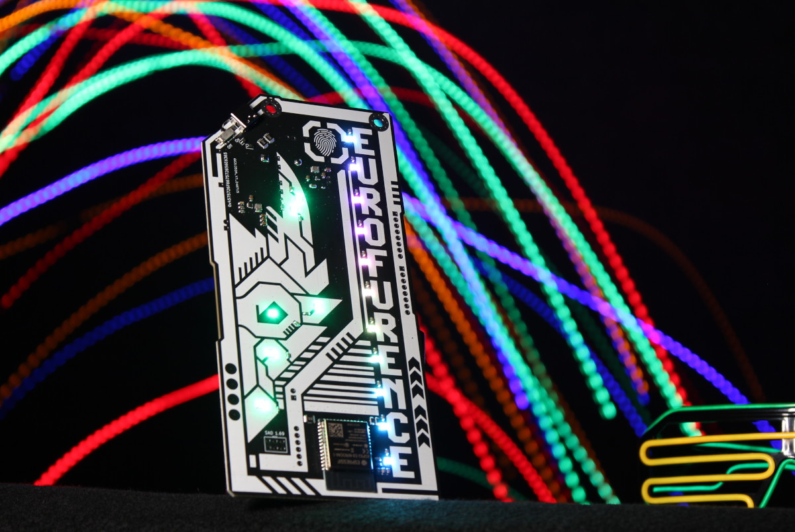
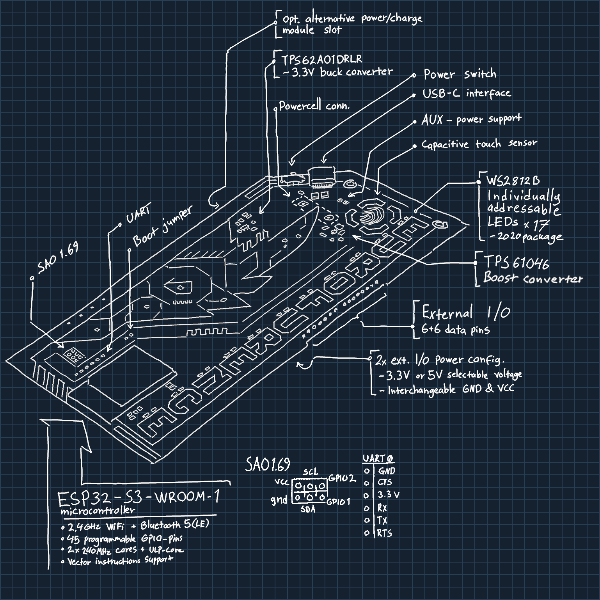
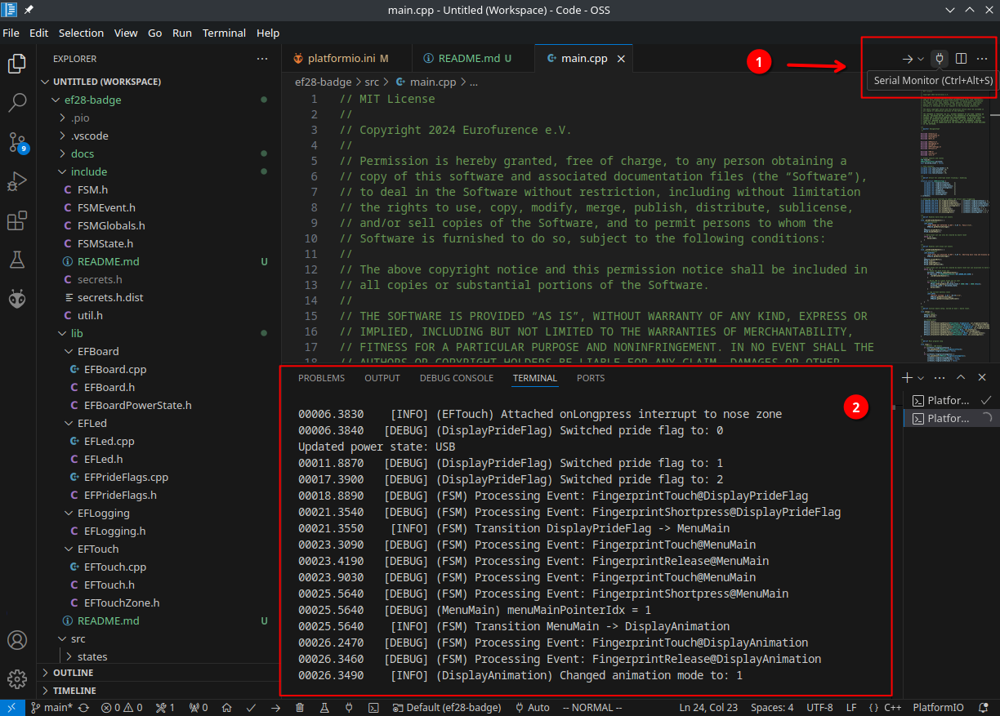
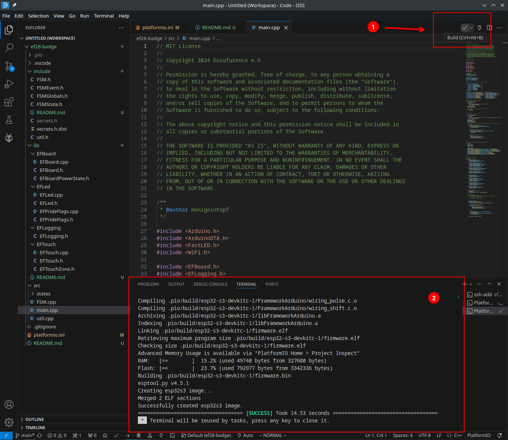
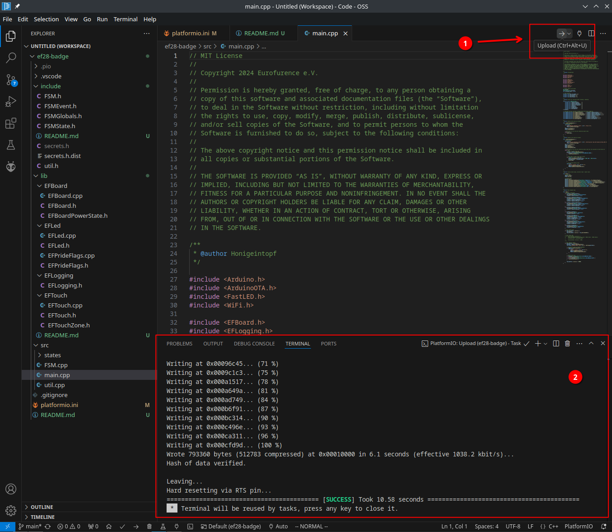
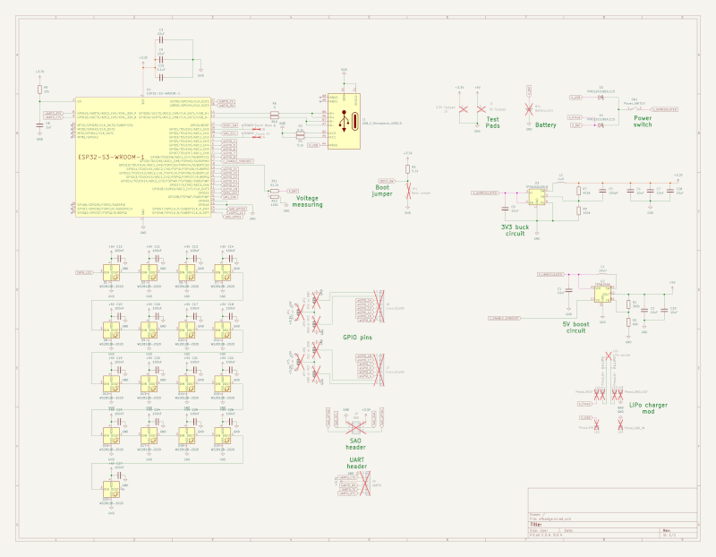

# Eurofurence 28 Cyber Badge

The cyber LED-Badge is a unique piece of wearable tech. At its core is a rigid
PCB (printed circuit board), assembled with electronic components, carefully
designed to be both functional and visually striking. On the back, you’ll find
a battery pack that powers the badge, ensuring that it can light up in a
spectrum of vibrant colors throughout the event.

The badge features 17 RGB LEDs, which can be controlled to display different
colors and patterns, allowing you to customize your experience. Whether you
want to flash your favorite colors, sync up with others, or simply let your
badge pulse with light as you move through the convention, the choice is yours.

## Technical Details

You can find the full schematics and PCB files in the
[Hardware Details](#hardware-details) section.

- Height: 15.9 cm
- Width: 7.7 cm
- Weight (w/o batteries): 56 g
- Weight (with batteries): ~126 g
- LEDs: 17x WS2812B RGB LEDs
- CPU: ESP32-S3-WROOM-1-N16R8 (Dual-Core, 16MB of Flash, Bluetooth, Wi-Fi)
- Battery holder: 3x AA batteries
- Runtime: Depending on the operation mode and used features, several to many hours
- Unpopulated headers: 2x8 GPIO, SAO 1.69
- User input: 2 touch buttons
- Attachment: Dual-nylon-loop lanyard (included)
- Connectivity: USB-C connector for powering or programming
- Power: Mechanical power switch

# Usage

TODO

## Default Firmware Features

TODO

## Serial Output / Logging

The badge logs most of its actions and current state onto the serial USB
console. It is available after connecting the badge via USB to your computer
and uses 115200 Baud 8N1.

To read the serial output you can use the serial monitor of your choice, for
example, the integrated serial monitor within VS Code (`CTRL + ALT + S`):

You can also use your favorite serial monitor, for example [minicom](https://salsa.debian.org/minicom-team/minicom):
`minicom -D /dev/ttyACM0 -b 115200`

# Building Your Own Firmware

The badge firmware is built using [PlatformIO](https://platformio.org/), an
extension for [Visual Studio Code](https://code.visualstudio.com/) that allows
beginners to quickly get hacking.

### Building with Visual Studio Code (VCS)

To set up your development environment, you need to:

1. Install Visual Studio Code and PlatformIO, as described in the official
   [PlatformIO documentation](https://docs.platformio.org/en/latest/integration/ide/vscode.html#installation)
2. Clone this repository to a suitable location (here: `~/git/ef28-badge`)
3. Open the project under `~/git/ef28-badge` using the PlatformIO IDE
4. Copy `include/secrets.h.dist` to `include/secrets.h` and adjust as needed
5. Execute the build by pressing the build button (1) or using the hotkey (`CTRL + ALT + B`)
6. Check that your build was successful (2)

_Note: The first build can take a while since additional tools and libraries
may need to be downloaded_

### Building from CLI

You can archive most things with the `pio` command from PlatformIO.

* Build firmware: `pio run`
* Upload firmware: `pio run --target upload`
* Clean generated files: `pio run --target clean`
* Attach serial monitor: `pio device monitor`

## Component Overview

The core of this firmware is implemented as a tick-based finite state machine
(FSM). Each operation mode is reflected by a corresponding FSM state.
Interrupts, e.g., from touch zones, trigger events which will be processed by
the FSM in the order they occurred during each tick. Every FSM state can define
its own tick rate. Board features, such as LEDs and touch zones, are available
via easy to use high-level APIs (see `lib/`).

A quick overview of the firmware components:

- `main.cpp`: The main entry point for the firmware. Initializes everything and
  ignites the FSM.
- `include/`: C++ headers
- `include/secrets.h(.dist)`: Custom defines for Wi-Fi and OTA
- `lib/EFBoard/`: Low-level initialization and power management
- `lib/EFLed/`: High-level interface to board LEDs, uses
  [FastLED](https://fastled.io/) under the hood
- `lib/EFLogging/`: Basic serial logging facilities
- `lib/EFTouch/`: High-level interface to touch sensors
- `src/FSM.cpp`: Implementation of the FSM logic
- `src/states/`: Implementation of all FSM states

## Flashing

After you've built your firmware, you can flash it by either connecting the
badge via USB to your computer, or by using over-the-air (OTA) updates.

_Note: OTA updates are only supported after an initial flash using a USB
connection_

### USB

To flash the firmware via USB, you need to:

1. Have a successful build of your firmware
2. Connect the badge via USB to your computer
3. **Close all serial monitors** that use the badges USB device
4. Click the upload button (1) or use the hotkey (`CTRL + ALT + U`)
5. Wait for the flashing to finish (2). Your badge will reboot after flashing.

_Note: Linux users might need to install the
[PlatformIO udev rules](https://docs.platformio.org/en/stable//core/installation/udev-rules.html)
prior to the first flashing._

#### Notes and Pitfalls

If you encounter issues flashing via USB, try the following:

* Some USB cables or ports are flaky. Try a different USB port or change the
  USB-C -> USB-C cable to a USB-A -> USB-C or vice versa.
* Make sure no program is opening the serial port while you flash. For example
  serial monitors in auto-connect mode.
* If it still fails, bridge the boot-pins when turning on. The badge should
  load into a simple bootloader and wait.

### Over-the-Air Updates (OTA)

If you want to flash the badge using over-the-air updates (OTA), it must be
connected to the same Wi-Fi network as your computer.

To flash a badge using OTA, you need to:

1. Make sure to have the correct Wi-Fi credentials supplied in `include/secrets.h`
2. Determine the badge IP address
    - This can be done by connecting your badge to your computer, opening the
      serial monitor, and letting it connect to your Wi-Fi. After a successful
      connection, the badge will print its IP and MAC addresses to the serial console.
3. Uncomment all `upload_*` entries in your `platformio.ini` and adjust
   `upload_port` to the IP address of your badge.
4. Ensure that the badge is in OTA mode
5. Click the upload button or use the hotkey (`CTRL + ALT + U`)
6. Wait for the flashing to finish. The badge will display the OTA progress
   using the LED bar, and the dragon eye will flash three times after a
   successful OTA update.

# Hardware Details

All hardware details, schematics, and PCB files of the badge are released as
[Open Source Hardware](https://www.oshwa.org/). Feel free to share, use, remix,
and extend them to your likings.

You can find the full [KiCad](https://www.kicad.org/) files inside the
`hardware` directory.

For convenience, here is an exported PDF version of the schematics:

# Useful links

* ESP32-S3 Pin-out and functions: https://github.com/atomic14/esp32-s3-pinouts

# Credits

This badge was designed, crafted and programmed with much love and dedication
by: [DarkRat](https://github.com/dunkelratte), [Token](https://github.com/TokenRat),
[Irah](https://github.com/tridekdu), [Honigeintopf](https://github.com/ngandrass).

The wonderful artwork is done by [Fleeks](https://www.furaffinity.net/user/fleeks).
